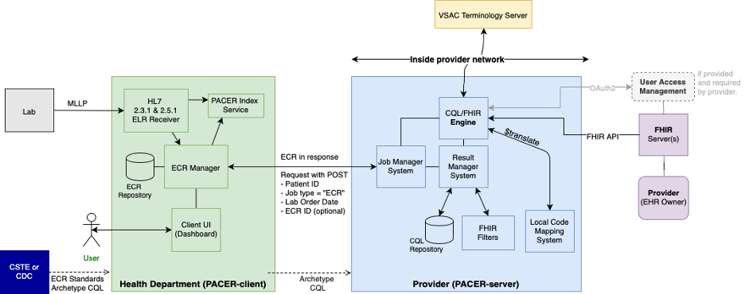

###################################
PACER Server
###################################

.. _server overview:

This is the documentation for the server components of PACER. The server is responsible for managing a request from the PACER client, maintaining the query strategy and logic for interfacing to the local FHIR server, and responding with the collected ECR format. On installation; the server is pointed towards a singular endpoint for a FHIR interface. Using Clinical Quality Language(CQL) scripts and some custom handling, PACER retrieves related FHIR resources, and maps to the local ECR json format.

PACER consists of: a JobManagementSystem for handling requests, a ResultsManager for handling FHIR results, a CQL Execution Service for executing CQL, a CQLStorage service for maintaining CQL scripts, a "FHIR Filter" service for redacting senstive data, and a Translation Service for translating local codesets into standardized codes.

.. _server installation:

Server Installation And Deploy Instructions
===========================================
PACER is a dockerized-project. It is preferable to build each component as a docker image and deploy with the Docker-Compose tool. For more information refer to

* Docker-CE (Community Edition). Refer to https://docs.docker.com/install/ for installation instructions
* Docker-Compose, version 1.3 or later. Refer to https://docs.docker.com/compose/install/ for installation instructions.

Pacer consists of 2 seperate docker-compose files: ``docker-compose-db.yml`` and ``docker-compose-apps.yml``.
* ``docker-compose-db.yml`` contains the configuration information for the database, and should be built and ran first before the docker-compose-apps.yml script.
* ``docker-compose-apps.yml`` consist of the application components that manage the PACER workflow.

To build and deploy the compose project follow these steps from the command line.
1. Review and confirm configration of the yaml files before installation. Refer to :ref:`configruation below <server configuration>` for more detailed instructions

2. Build the database and application projects

.. code-block:: console

    docker-compose -f docker-compose-db.yml build
    docker-compose -f docker-compose-apps.yml build

This will build deployable images for 6 different containers.

* ``cql-storage``
* ``cql-execution``
* ``db``
* ``fhir-filter``
* ``job-management-system``
* ``results-manager``

3. Deploy dockerfiles in stages using compose.

.. note::
    Again before deploying, it is recommended to refer to :ref:`server configruation below <server configuration>` to ensure connection to the FHIR server is correct

.. code-block:: console

    docker-compose -f docker-compose-db.yml up -d #wait for the database service to complete it's initdb.script
    docker-compose -f docker-compose-apps.yml up -d

This will turn on all application components and enable networking for the PACER application to recieve requests.

.. _server configuration:

Configuration
=============

Before the server can be deployed, configuration within the ``docker-compose-apps.yml`` file must be reviewed
The yml file describes confirugation for each of the above components. Confirugation is passed as envrionment variables into each container.

Configuration Requirements
--------------------------

    +  ``results-manager/CQL_EXECUTION_DATA_SERVICE`` This is a defined baseurl to the hosted fhir server to be used. FHIR url paths should end in ``/fhir/`` as the baseurl.
    +  ``results-manager/CQL_EXECUTION_DATA_USER`` If the FHIR server uses  `Basic Authentication <https://www.twilio.com/docs/glossary/what-is-basic-authentication>`_ for authentication; provide a username here.
    +  ``results-manager/CQL_EXECUTION_DATA_PASS`` If the FHIR server uses  `Basic Authentication <https://www.twilio.com/docs/glossary/what-is-basic-authentication>`_ for authentication; provide a password here.
    +  ``results-manager/CQL_EXECUTION_EPIC_CLIENT_ID`` If the FHIR server uses  `Bearer Token Authentication <https://swagger.io/docs/specification/authentication/bearer-authentication/>`_  generate a service token for PACER and apply the plaintext token string here.
    +  ``results-manager/CQL_EXECUTION_TERMINOLOGY_SERVICE`` If a terminology service is provided via FHIR, provide the service url. FHIR url paths should end in ``/fhir/`` as the baseurl.
    +  ``results-manager/CQL_EXECUTION_TERMINOLOGY_USER`` If the terminology server uses  `Basic Authentication <https://www.twilio.com/docs/glossary/what-is-basic-authentication>`_ for authentication; provide a username here.
    +  ``results-manager/CQL_EXECUTION_TERMINOLOGY_PASS`` If the terminology service uses  `Basic Authentication <https://www.twilio.com/docs/glossary/what-is-basic-authentication>`_ for authentication; provide a password here.
    + ``results-manager/CQL_EXECUTION_CODEMAPPER_SYSTEMS_MAP`` If the FHIR server uses local system definitions for common terminology systems (LOINC, Snomed, RxNorm), provide a key:value pair for the general url to the local system url provided. An example is provided in the comments for creating this key:value pair.

.. _server FHIR Server:

External FHIR Server
====================

The external FHIR server is the system managed FHIR server. In addition to read capabilities in each resource, It is expected to support these specific search capabilities

FHIR Server Requirements
------------------------

    + ``Patient``
        + ``?identifier`` Identifier search parameter is used to identify the patient.

    + ``Condition``
        + ``?patient`` Patient id related to the Condition
        + ``?category`` Code search with supported condition category types
        + ``?code:in`` Code search param used with :in modifier to provide large concept sets to be searched.

    + ``Encounter``
        + ``?patient`` Patient id related to the Encounter

    + ``Immmunization``
        + ``?patient`` Patient id related to the Immmunization

    + ``Medication``
        + ``?code:in`` Code search param used with :in modifier to provide large concept sets to be searched.

    + ``MedicationRequest``
        + ``?patient`` Patient id related to the MedicationRequest
        + ``code:in`` Code search param used with :in modifier to provide large concept sets to be searched.

    + ``Observation``
        + ``?patient`` Patient id related to the Observation
        + ``?category`` Code search with supported observation category types
        + ``code:in`` Code search param used with :in modifier to provide large concept sets to be searched.

.. warning::
    In cases where MedicationRequest search code is not available, a Medication Reference must be provided within the response json; in order to retrieved related medication data.

.. _server Job Management System:

Job Management System
=====================

Job Management System: Overview
-------------------------------
<ECR Manager Information here>

Job Management System: API Documentation
----------------------------------------
<ECR Manager API Review here>

.. _server Results Manager:

Results Manager
===============

Results Manager: Overview
-------------------------
<Results Manager Information here>

Results Manager: API Documentation
----------------------------------
<Results Manager API Review here>

.. _server CQL Storage:

CQL Storage
============

CQL Storage: Overview
---------------------
<CQL Storage Information here>

CQL Storage: API Documentation
------------------------------
<CQL Storage API Review here>

.. _server CQL Execution Service:

CQL Execution Service
=====================

CQL Execution Service: Overview
-------------------------------
<CQL Execution Service here>

CQL Execution Service: API Documentation
----------------------------------------
<CQL Execution Service API Review here>

.. _server FHIR Filter:

FHIR Filter
===========

FHIR Filter: Overview
---------------------
<FHIR Filter here>

FHIR Filter: API Documentation
------------------------------
<FHIR Filter API Review here>

.. _server Translate Concept Service:

Translate Concept Service
=========================

Translate Concept Service: Overview
-----------------------------------
<Translate Concept Service here>

Translate Concept Service: API Documentation
--------------------------------------------
<Translate Concept Service API Review here>